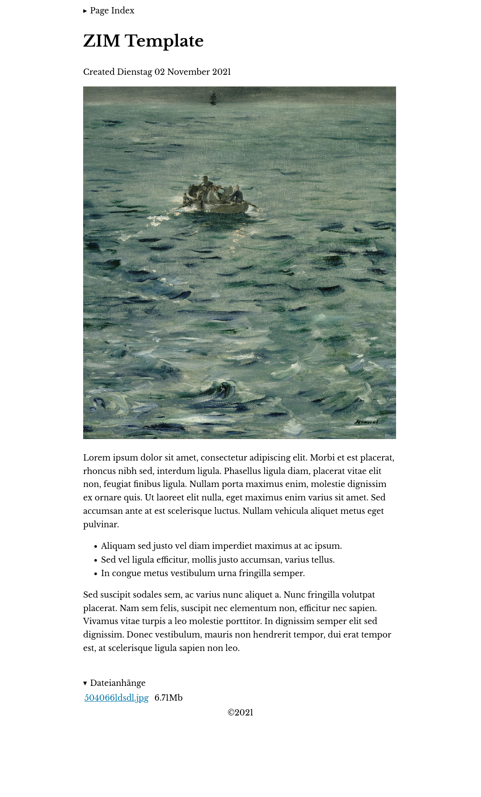

# Manet
A Simple HTML Template to use with the [ZIM Desktop Wiki](https://zim-wiki.org).

* no JavaScript
* embedded CSS
* 1 external font
* small: example page from screenshot is only 7 kB HTML

## Installation
For Linux:
```sh
curl -O ~/.local/share/zim/templates/html/manet.html \
   https://github.com/stelzch/zim-template-manet/raw/master/manet.html
```


In doubt consult the [ZIM manual page on templates.](https://zim-wiki.org/manual/Help/Templates.html)
## Screenshot

